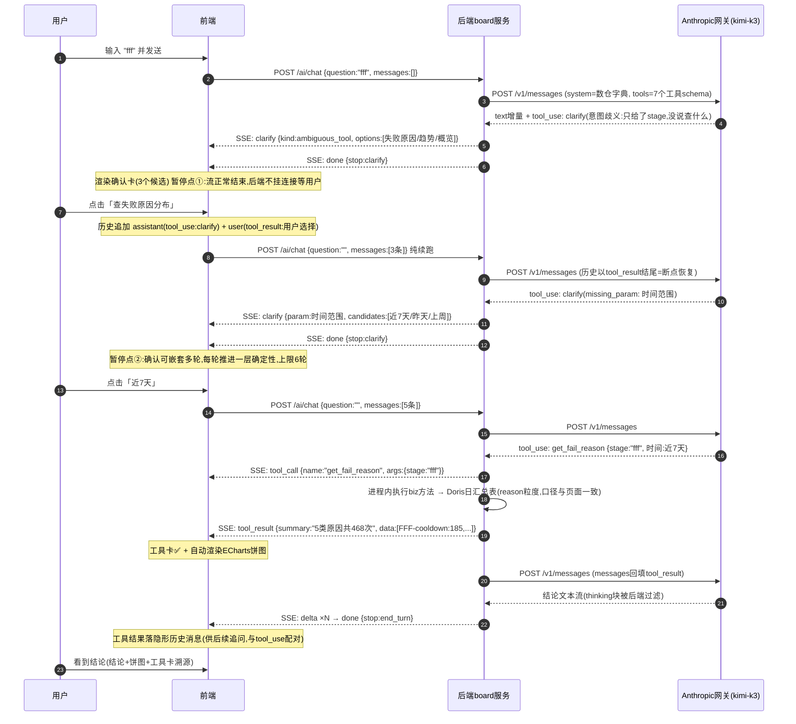
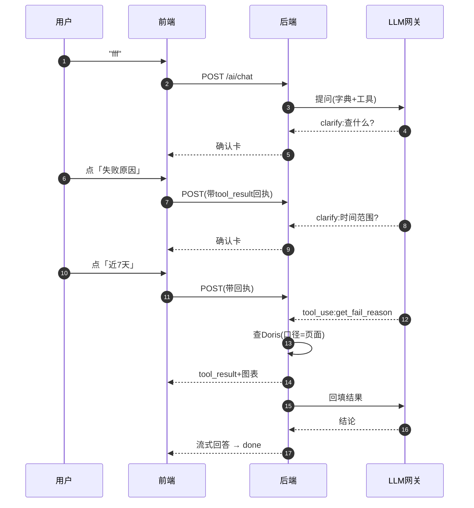

# AI 问答时序图(Mermaid 版,粘贴到飞书用)

用法:飞书文档 → 输入 `/代码块`(或插入代码块)→ 语言下拉选 **Mermaid** → 把下面任一代码块的源码粘进去 → 自动渲染成时序图(代码块右上角可切换 源码/图形 视图)。

## 完整版:用户输入"fff" → 两次确认 → 工具执行 → 最终结果

```mermaid
sequenceDiagram
    autonumber
    participant U as 用户
    participant F as 前端
    participant B as 后端board服务
    participant L as Anthropic网关(kimi-k3)

    U->>F: 输入 "fff" 并发送
    F->>B: POST /ai/chat {question:"fff", messages:[]}
    B->>L: POST /v1/messages (system=数仓字典, tools=7个工具schema)
    L-->>B: text增量 + tool_use: clarify(意图歧义:只给了stage,没说查什么)
    B-->>F: SSE: clarify {kind:ambiguous_tool, options:[失败原因/趋势/概览]}
    B-->>F: SSE: done {stop:clarify}
    Note over F: 渲染确认卡(3个候选) 暂停点①:流正常结束,后端不挂连接等用户

    U->>F: 点击「查失败原因分布」
    Note over F: 历史追加 assistant(tool_use:clarify) + user(tool_result:用户选择)
    F->>B: POST /ai/chat {question:"", messages:[3条]} 纯续跑
    B->>L: POST /v1/messages (历史以tool_result结尾=断点恢复)
    L-->>B: tool_use: clarify(missing_param: 时间范围)
    B-->>F: SSE: clarify {param:时间范围, candidates:[近7天/昨天/上周]}
    B-->>F: SSE: done {stop:clarify}
    Note over F: 暂停点②:确认可嵌套多轮,每轮推进一层确定性,上限6轮

    U->>F: 点击「近7天」
    F->>B: POST /ai/chat {question:"", messages:[5条]}
    B->>L: POST /v1/messages
    L-->>B: tool_use: get_fail_reason {stage:"fff", 时间:近7天}
    B-->>F: SSE: tool_call {name:"get_fail_reason", args:{stage:"fff"}}
    B->>B: 进程内执行biz方法 → Doris日汇总表(reason粒度,口径与页面一致)
    B-->>F: SSE: tool_result {summary:"5类原因共468次", data:[FFF-cooldown:185,...]}
    Note over F: 工具卡✅ + 自动渲染ECharts饼图
    B->>L: POST /v1/messages (messages回填tool_result)
    L-->>B: 结论文本流(thinking块被后端过滤)
    B-->>F: SSE: delta ×N → done {stop:end_turn}
    Note over F: 工具结果落隐形历史消息(供后续追问,与tool_use配对)
    U->>F: 看到结论(结论+饼图+工具卡溯源)
```

## 精简版(适合汇报页,一眼看完)

```mermaid
sequenceDiagram
    autonumber
    participant U as 用户
    participant F as 前端
    participant B as 后端
    participant L as LLM网关

    U->>F: "fff"
    F->>B: POST /ai/chat
    B->>L: 提问(字典+工具)
    L-->>B: clarify:查什么?
    B-->>F: 确认卡
    U->>F: 点「失败原因」
    F->>B: POST(带tool_result回执)
    L-->>B: clarify:时间范围?
    B-->>F: 确认卡
    U->>F: 点「近7天」
    F->>B: POST(带回执)
    L-->>B: tool_use:get_fail_reason
    B->>B: 查Doris(口径=页面)
    B-->>F: tool_result+图表
    B->>L: 回填结果
    L-->>B: 结论
    B-->>F: 流式回答 → done
```
